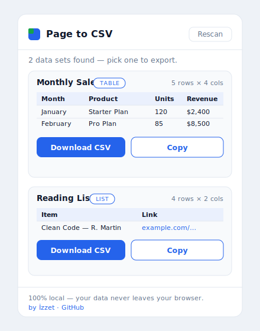

<div align="center">

# Page to CSV — Table & List Extractor



**Extract any table or list on a web page to a clean CSV with one click.**
No setup. No account. No servers. Everything runs in your browser.

[](https://github.com/lfameS/page-to-csv/actions/workflows/ci.yml)


</div>

---

## Why this exists

Copying data off a web page into a spreadsheet is tedious, and most "scraper" tools route your page through a remote server. **Page to CSV does it locally** — it reads the page only when you click the icon, processes everything in the browser, and never makes a network request. No backend, no analytics, no account.

## Features

| | |
|---|---|
| 🧷 **Tables** | Detects every `<table>`, with proper **colspan + rowspan** grid normalization so columns stay aligned (works on Wikipedia-style merged cells). |
| 📋 **Lists** | Detects `<ul>` / `<ol>` lists and captures item text **plus links** as a second column. Skips nav menus. |
| 🧠 **Smart labels** | Names each data set from its caption or nearest heading, so downloads get a meaningful filename. |
| 🧹 **Clean CSV** | RFC-style escaping for quotes, commas and newlines; **UTF-8 BOM** so Excel opens Turkish/non-ASCII text correctly. |
| 📋 **Copy or download** | One click to download a `.csv`, or copy to clipboard to paste straight into Sheets/Excel. |
| 🔒 **100% local** | `activeTab` + `scripting` permissions only. No host permissions, no network calls, no tracking. |

## Install (load unpacked)

Works in any Chromium browser — **Brave**, Chrome, Edge, Opera, Vivaldi.

1. Download or clone this repo.
2. (Optional) `node gen-icons.js` to generate the icons.
3. Open the extensions page — **Brave:** `brave://extensions` · Chrome: `chrome://extensions` · Edge: `edge://extensions`
4. Enable **Developer mode** (top-right).
5. Click **Load unpacked** and select this folder.
6. Pin it, then try it on the included `demo/sample.html` or any page with a table.

## Usage

1. Open a page with a table or list.
2. Click the **Page to CSV** icon.
3. Pick a data set → **Download CSV** or **Copy**.

## How it works

```
popup opens ─▶ inject scanAndExtract() into the active tab (activeTab grant)
                    │
                    ▼
        find <table> + <ul>/<ol> ─▶ normalize to a grid ─▶ return plain 2D text
                    │
                    ▼
popup previews each set ─▶ you click Export ─▶ CSV built locally ─▶ download / clipboard
```

## Project structure

```
manifest.json        MV3 manifest (activeTab + scripting only)
popup.html / .css    Popup UI
popup.js             Page scan, table/list extraction, CSV build, download/copy
gen-icons.js         Generates the PNG icons from code (no image libraries)
demo/sample.html     A test page to try the extension instantly
.github/workflows    CI: validates JSON + JS syntax on every push
```

## Development

```bash
node gen-icons.js     # regenerate icons
node --check popup.js # syntax check
```
CI runs the same JSON/JS validation on every push and pull request.

## Roadmap

- [ ] Column picking / renaming before export
- [ ] Auto-detect repeated "card" grids (div-based, not just `<table>`/`<ul>`)
- [ ] One-click export to Google Sheets

## Contributing

Issues and PRs welcome — see [CONTRIBUTING.md](CONTRIBUTING.md).

## Author

Built by **İzzet** — I make small, focused tools like this (Chrome extensions, scrapers, n8n/AI automations, API integrations), fast and clean. More at **[github.com/lfameS](https://github.com/lfameS)**.

## License

[MIT](LICENSE) © 2026 İzzet Koyak
